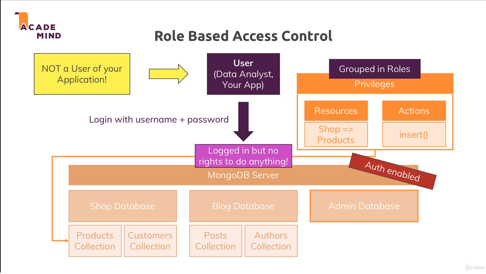
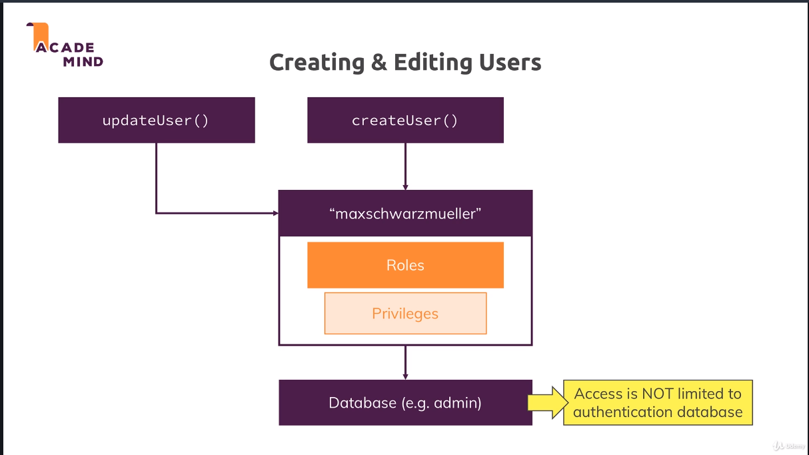

# Security & User Authentication

## Security Checklist

1. Authentication & Authorization
    - Db has users, and your code will have to authenticate w/ the db to do CRUD operations
1. Transport Encryption
    - Data that is sent from app to server is encrypted
1. Encryption at Rest
    - Data in Db needs to be encrypted
1. Auditing
    - Who did what, which actions occured
1. Server & Network Config and Setup
    - Network you are using to host MongoDB should also be secured
1. Backups & Software Updates
    - Regularly backup data
    - Make sure software is up-to-date for security updates

## Role Based Access Control

1. Authentication
    - Identifies valid users of the db
    - Analogy: You are employed and may access the office
1. Authorization
    - Identifies what these users may actually do in the db
    - Analogy: You are employed as an accountant and may access office and process orders



## Why Roles?

**Different Types of Database Users**

1. Administrator
    - Needs to be able to manage the db config, create users, etc
    - Does NOT need to be able to insert or fetch data
1. Developer/App
    - Needs to be able to do CRUD
    - Does NOT need to be able to create users or manage db config
1. Data Scientist
    - Needs to be able to fetch data
    - Soesn't need to create users, manage config, or insert/delete

## Create/Edit User



## Set Up Authorization

```
mongod --auth
```

## Built-in Roles

[Official Doc](https://docs.mongodb.com/manual/reference/built-in-roles/)

1. Database User
    - read
    - readWrite
1. Database Admin
    - dbAdmin
    - userAdmin
    - dbOwner
1. All Database Roles
    - readAnyDatabase
    - readWriteAnyDatabase
    - userAdminAnyDatabase
    - dbAdminAnyDatabase
1. Cluster Admin (constructs where you have multiple servers working together)
    - clusterManager
    - clusterMonitor
    - hostManager
    - clusterAdmin
1. Backup/Restore
    - backup
    - restore
1. Superuser
    - dbOwner (admin)
    - userAdmin (admin)
    - userAdminAnyDatabase
    - root