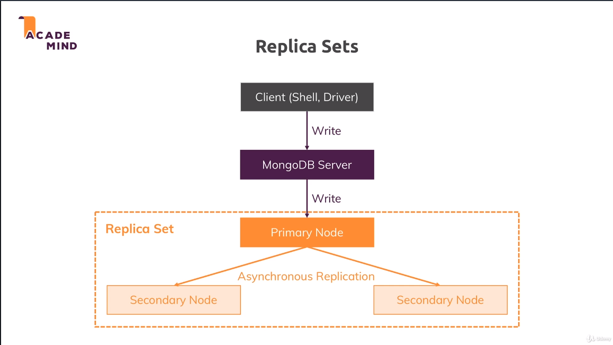
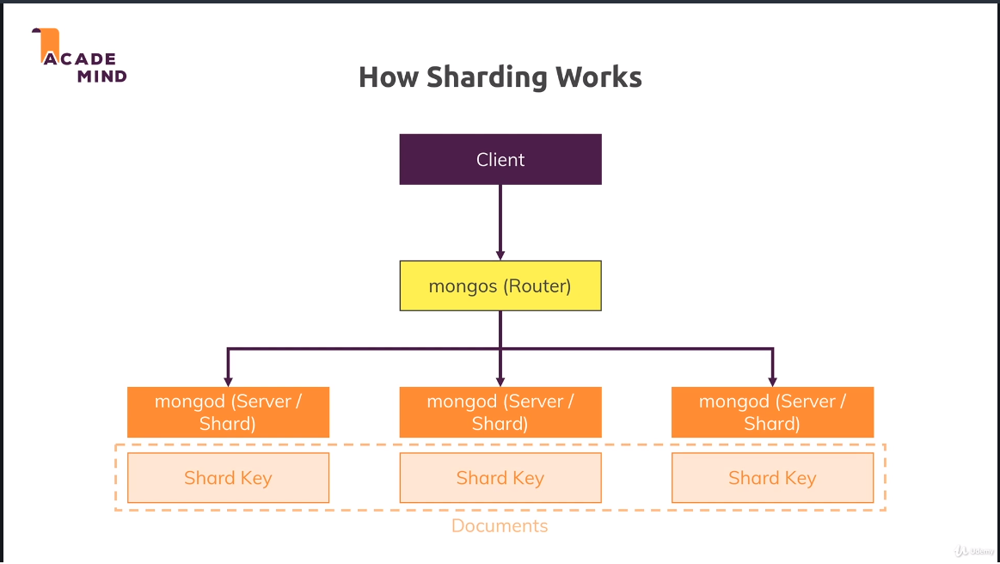
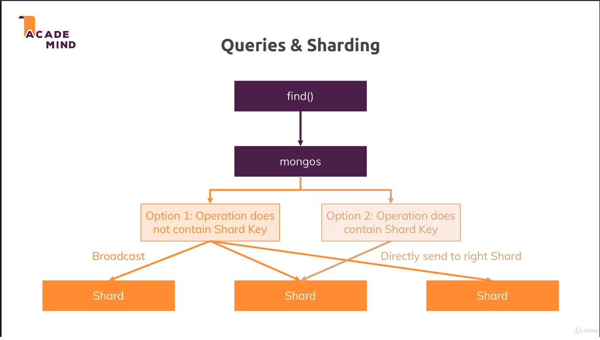
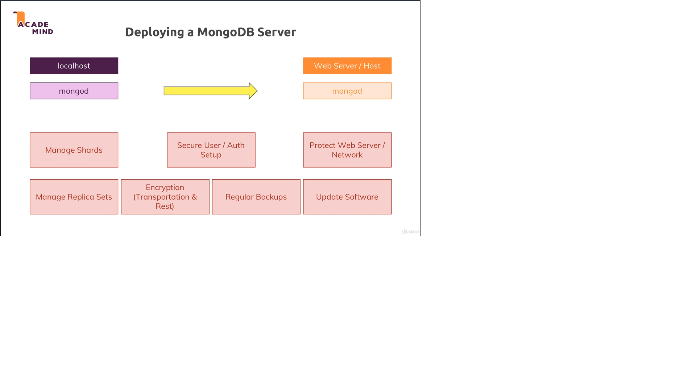
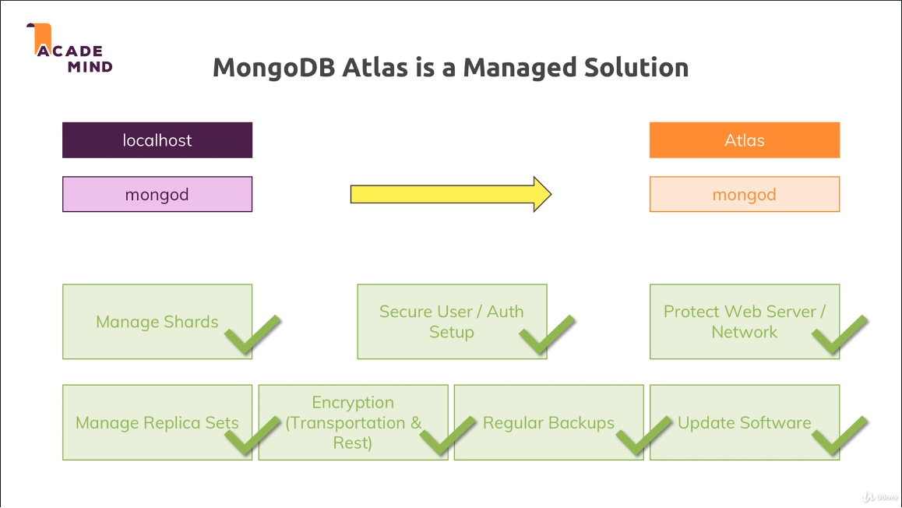
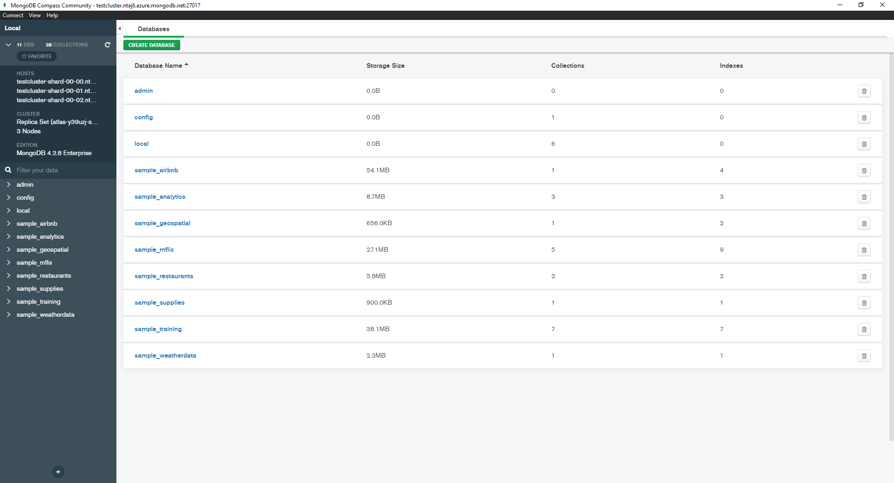

# Performance, Fault-Tolerance, & Deployment

Entering the Enterprise World

## What Influences Performance

### Developer/DB Admin

1. Efficient Queries/Operations
1. Indexes
1. Fitting Data Schema

### DB Admin / System Admin

1. Hardware & Network
1. Sharding
1. Replica Sets

## Capped Collections

Simply a collection that has a max size, and a max number of documents allowed

New documents are written, old ones removed when max is hit

## Replica Sets

[Official Documentation](https://docs.mongodb.com/manual/replication/)



We use replicate sets in case the primary node goes offline

1. Backup/Fault Tolerancy
1. Improve Read Performance
    - Writes always go to primary
    - Reads can be spread out

## Sharding (Horizontal Scaling)

[Official Documentation](https://docs.mongodb.com/manual/sharding/)

Your DB is spread across multiple servers

1. Data is distributed (not replicated) across Shards
1. Queries are run across all shards

### How Sharding Works



### Querying & Sharding



## Deploying a MongoDB Server



Most of the above is beyond the developer scope

We will use a 'Managed Solution'

MongoDB Attlas



Worth noting, a lot of the above (replication and sharding) is **not** available on the free tier

## Connecting to Cluster

```
mongo "mongodb+srv://testcluster.ntaj6.azure.mongodb.net/sample_airbnb" --username gary
```

**Connect with User you created on cluster**

You may have to worry about password encoding

[Password Troubleshooting](https://docs.atlas.mongodb.com/troubleshoot-connection/#special-characters-in-connection-string-password)



1. This shows me connected to my cluster in atlas
1. You can see it's on 3 shards and has a replica set
1. I loaded test data from Mongo