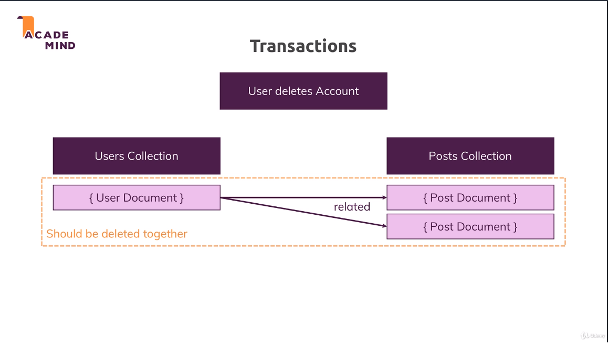

# Transactions

[Official Docs](https://docs.mongodb.com/manual/core/transactions/)

**Need a replica set to make this work**

## What Are Transactions

What happens if we delete the user document, but fail to delete the post documents?
- Maybe we had a server outage, etc...
- Transactions saves us in this instance